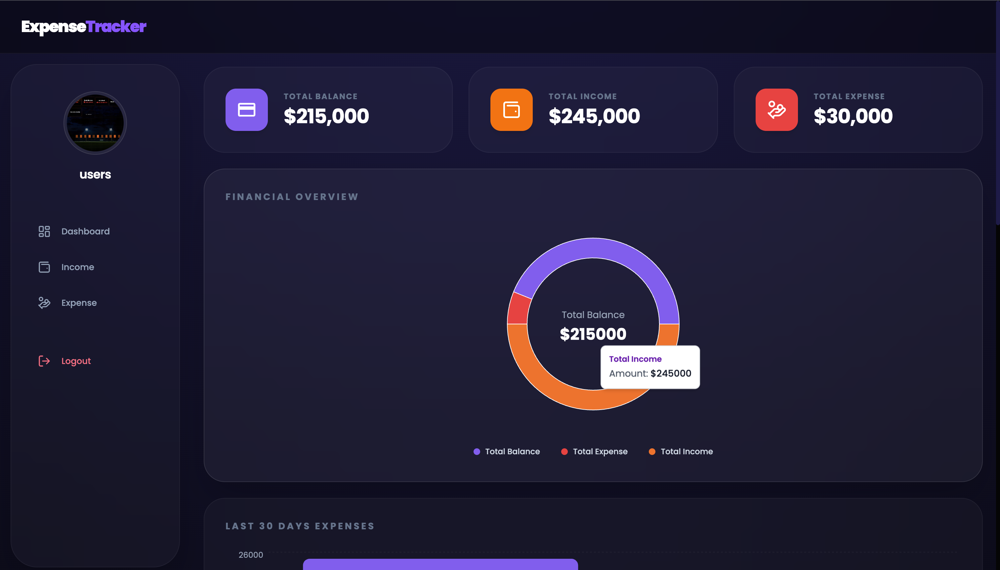
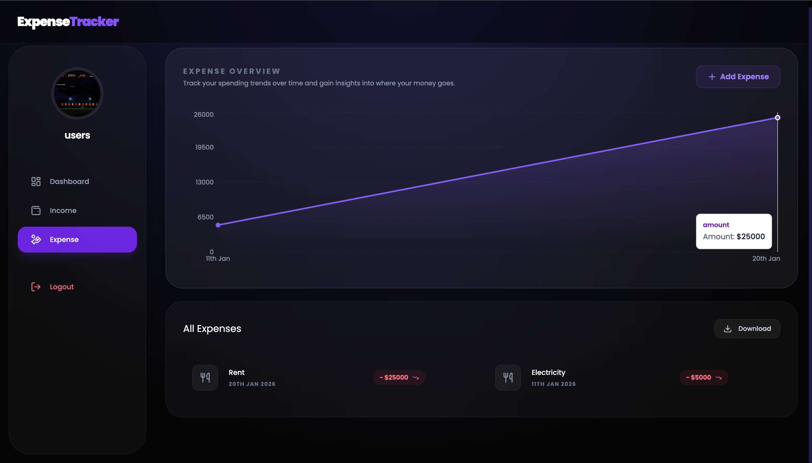
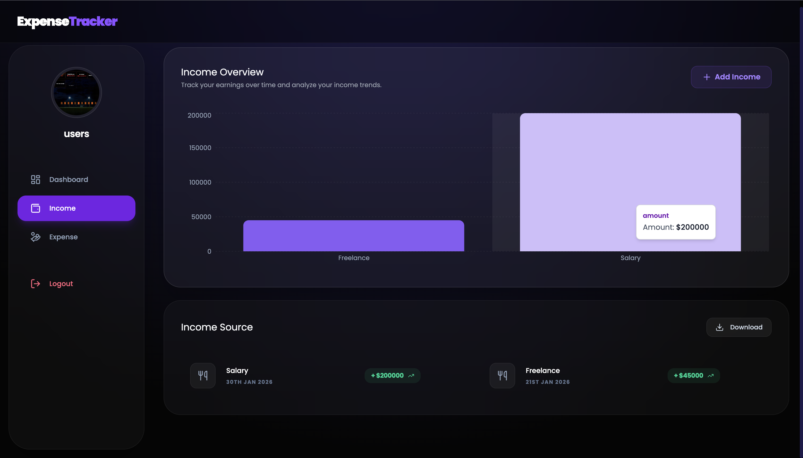

#  Expense Tracker – Full Stack Application

A full-stack Expense Tracker web application that helps users manage their income, expenses, and balance efficiently. Built with a React (Vite) frontend and a Node.js + Express + MongoDB backend.

---

##  Features

- JWT-based user authentication
- Add, edit, and delete income & expense records
- Automatic balance calculation
- Category-wise and date-wise tracking
- Interactive charts and analytics
- Export expenses to Excel
- File upload support (receipts)
- Emoji support
- Responsive UI with Tailwind CSS
- Toast notifications

---

### Screenshots

**Homepage**

**Add Expense**

*Add Income**

---

## Tech Stack

### Frontend
- React 19
- Vite
- Tailwind CSS
- React Router DOM
- Axios
- Recharts
- Moment.js
- React Icons
- React Hot Toast
- Emoji Picker

### Backend
- Node.js
- Express.js
- MongoDB
- Mongoose
- JWT Authentication
- Bcrypt.js
- Multer (File Upload)
- XLSX (Excel Export)
- CORS
- dotenv

---

##  Project Structure

expense-tracker/
│
├── frontend/
│   ├── src/
│   ├── package.json
│   └── vite.config.js
│
├── backend/
│   ├── models/
│   ├── routes/
│   ├── controllers/
│   ├── middleware/
│   ├── server.js
│   └── package.json
│
└── README.md

---

##  Installation & Setup

### 1️⃣ Clone Repository

git clone https://github.com/your-username/expense-tracker.git  
cd expense-tracker

---

### 2️⃣ Frontend Setup

cd frontend  
npm install  
npm run dev  

Frontend runs at:  
http://localhost:5173

---

### 3️⃣ Backend Setup

cd backend  
npm install  
npm run dev  

Backend runs at:  
http://localhost:5000

---

##  Environment Variables (Backend)

Create a .env file in backend folder:

PORT=5000  
MONGO_URI=your_mongodb_connection_string  
JWT_SECRET=your_secret_key  

---

##  Available Scripts

### Frontend
- npm run dev – Start development server
- npm run build – Build for production
- npm run preview – Preview build
- npm run lint – Run ESLint

### Backend
- npm start – Start server
- npm run dev – Start server with nodemon

---

##  Problem Statement

Managing expenses manually is time-consuming and error-prone. This application provides a secure and easy way to track income, expenses, and financial health.

---

